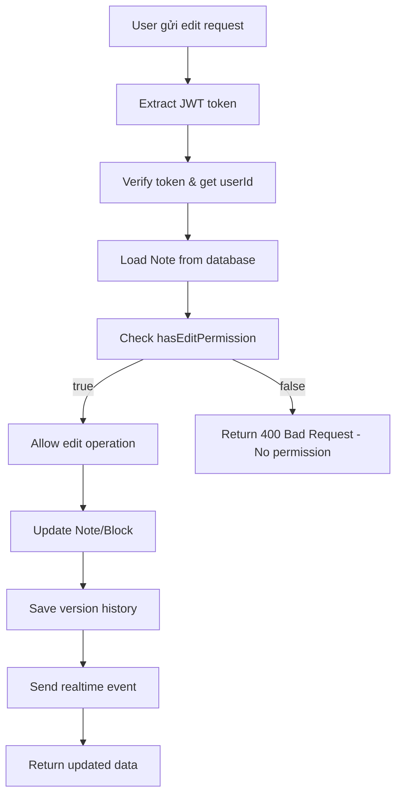

# Note System - Frontend Integration Documentation

## 📋 Tổng quan
Backend Note System hỗ trợ 2 loại ghi chú:
- **Markdown**: Lưu nội dung dạng text markdown
- **Block**: Lưu nội dung dạng blocks tương tự Notion

Hệ thống hỗ trợ:
- ✅ CRUD operations cho Notes và Blocks
- ✅ Hệ thống phân quyền (Owner, Editor, Viewer)
- ✅ Collaborative editing với realtime updates
- ✅ Comment system
- ✅ Version history
- ✅ Tag management
- ✅ Advanced search & filtering

## 🔐 Authentication & JWT Flow

### JWT Token Structure
```typescript
interface JWTPayload {
  sub: string;           // User email
  userId: number;        // User ID
  exp: number;          // Expiration timestamp
  iat: number;          // Issued at timestamp
}
```

### Authentication Headers
Tất cả API đều yêu cầu JWT token trong header:
```http
Authorization: Bearer <jwt-token>
Content-Type: application/json
```

### Authentication Flow
1. User đăng nhập → Backend trả về JWT token
2. Frontend lưu token (localStorage/sessionStorage)
3. Mọi request đến Note API phải include token trong header
4. Backend verify token và extract user info
5. Permissions được check dựa trên user và note ownership/collaboration

## 🌐 Base URLs
```
tôi đã cập nhập trong biến môi trường nên không cần quan tâm tới vấn đề này
Development: http://localhost:8080/api/v1
Production: https://your-domain.com/api/v1
```

---

## 📊 Data Types & Enums

### NoteType Enum
```typescript
type NoteType = "markdown" | "block"
```

### BlockType Enum
```typescript
type BlockType =
  // Text & Heading
  | "paragraph" | "heading_1" | "heading_2" | "heading_3"
  // List & Todo
  | "bulleted_list_item" | "numbered_list_item" | "to_do" | "toggle"
  // Formatting
  | "quote" | "callout" | "divider" | "code"
  // Media & Data
  | "table" | "table_row" | "image" | "video" | "file" | "bookmark" | "embed"
  // Advanced / Database
  | "page" | "database_table" | "database_board" | "database_calendar" | "database_gallery"
  // Inline Embed
  | "equation" | "mention_user" | "mention_page" | "mention_date"
```

### NotePermission Enum
```typescript
type NotePermission = "OWNER" | "EDITOR" | "VIEWER"
```

### Permission Matrix
| Action | OWNER | EDITOR | VIEWER |
|--------|-------|--------|--------|
| View Note | ✅ | ✅ | ✅ |
| Edit Note | ✅ | ✅ | ❌ |
| Delete Note | ✅ | ❌ | ❌ |
| Add/Remove Collaborators | ✅ | ❌ | ❌ |
| Add Comments | ✅ | ✅ | ✅ |
| Delete Comments | ✅ (any) | ✅ (own) | ✅ (own) |

---

## 🏗️ Data Structures

### Note Object
```typescript
interface Note {
  id: number;
  title: string;
  type: NoteType;
  content?: string;           // Chỉ có khi type = "markdown"
  ownerId: number;
  isDeleted: boolean;
  blocks?: Block[];           // Chỉ có khi type = "block"
  tags: string[];
  createdAt: string;          // ISO 8601 format
  updatedAt: string;          // ISO 8601 format
}
```

### Block Object
```typescript
interface Block {
  id: number;
  type: BlockType;
  orderIndex: number;
  content: any;               // JSON object - cấu trúc tùy thuộc vào block type
}
```

### Collaborator Object
```typescript
interface Collaborator {
  userId: number;
  permission: NotePermission;
}
```

### Comment Object
```typescript
interface Comment {
  id: number;
  userId: number;
  blockId?: number;           // Optional - comment on specific block
  content: string;
  createdAt: string;
  updatedAt: string;
  parentId?: number;          // For threaded comments
  isDeleted: boolean;
}
```

### Version Object
```typescript
interface NoteVersion {
  id: number;
  noteId: number;
  userId: number;
  action: NoteAction;
  diff: any;                  // JSON object containing changes
  createdAt: string;
}

type NoteAction =
  | "CREATE_NOTE" | "UPDATE_NOTE" | "DELETE_NOTE"
  | "CREATE_BLOCK" | "UPDATE_BLOCK" | "DELETE_BLOCK" | "REORDER_BLOCKS"
  | "ADD_COLLABORATOR" | "REMOVE_COLLABORATOR"
  | "ADD_COMMENT" | "DELETE_COMMENT"
```

---

## 📝 Request/Response DTOs

### CreateNoteRequest
```typescript
interface CreateNoteRequest {
  title: string;              // Required, không được rỗng
  type?: NoteType;            // Optional, mặc định "block"
  content?: string;           // Optional, dùng cho markdown
  blocks?: BlockRequest[];    // Optional, dùng cho block
  tags?: string[];            // Optional
}
```

### UpdateNoteRequest
```typescript
interface UpdateNoteRequest {
  title: string;              // Required
  type?: NoteType;            // Optional
  content?: string;           // Optional, dùng cho markdown
  blocks?: BlockRequest[];    // Optional, dùng cho block (sẽ replace all)
  tags?: string[];            // Optional (sẽ replace all)
}
```

### BlockRequest
```typescript
interface BlockRequest {
  type: BlockType;            // Required
  orderIndex: number;         // Required
  content: any;               // Required - JSON object
}
```

### ReorderBlocksRequest
```typescript
interface ReorderBlocksRequest {
  noteId: number;             // Required
  orderedBlockIds: number[];  // Required - array of block IDs in new order
}
```

### CollaboratorRequest
```typescript
interface CollaboratorRequest {
  userId: number;             // Required
  permission: NotePermission; // Required
}
```

### CommentRequest
```typescript
interface CommentRequest {
  content: string;            // Required
  blockId?: number;           // Optional - comment on specific block
  parentId?: number;          // Optional - reply to comment
}
```

### PaginatedResponse
```typescript
interface PaginatedResponse<T> {
  content: T[];
  page: number;
  size: number;
  totalElements: number;
  totalPages: number;
  first: boolean;
  last: boolean;
}
```

---

## 🔌 API Endpoints

### 📋 Notes CRUD

#### 1. List Notes
```http
GET /user/notes
```

**Query Parameters:**
- `page` (optional): Page number, default = 0
- `size` (optional): Page size, default = 20
- `query` (optional): Search in title and content
- `ownerId` (optional): Filter by owner ID
- `tag` (optional): Filter by tag name

**Response:**
```typescript
PaginatedResponse<Note>
```

**Example:**
```typescript
// Get first page with 10 notes
GET /user/notes?page=0&size=10

// Search for notes containing "react"
GET /user/notes?query=react

// Get notes with tag "frontend"
GET /user/notes?tag=frontend

// Get notes owned by user ID 123
GET /user/notes?ownerId=123
```

#### 2. Get Single Note
```http
GET /user/notes/{id}
```

**Response:**
```typescript
Note
```

**Permissions:** Requires VIEW permission (owner, editor, or viewer)

#### 3. Create Note
```http
POST /user/notes
```

**Request Body:**
```typescript
CreateNoteRequest
```

**Response:**
```typescript
Note
```

**Example - Markdown Note:**
```json
{
  "title": "My Markdown Note",
  "type": "markdown",
  "content": "# Hello World\nThis is **markdown** content.",
  "tags": ["tutorial", "markdown"]
}
```

**Example - Block Note:**
```json
{
  "title": "My Block Note",
  "type": "block",
  "blocks": [
    {
      "type": "heading_1",
      "orderIndex": 0,
      "content": {"text": "Welcome"}
    },
    {
      "type": "paragraph",
      "orderIndex": 1,
      "content": {"text": "This is a paragraph block."}
    }
  ],
  "tags": ["project", "notes"]
}
```

#### 4. Update Note
```http
PUT /user/notes/{id}
```

**Request Body:**
```typescript
UpdateNoteRequest
```

**Response:**
```typescript
Note
```

**Permissions:** Requires EDIT permission (owner or editor)

**Note:** Khi update blocks, tất cả blocks cũ sẽ bị xóa và thay thế bằng blocks mới trong request.

#### 5. Delete Note
```http
DELETE /user/notes/{id}
```

**Response:** `204 No Content`

**Permissions:** Chỉ OWNER mới có thể xóa note

---

### 🧱 Block Operations

#### 1. Add Block
```http
POST /user/notes/{noteId}/blocks
```

**Request Body:**
```typescript
BlockRequest
```

**Response:**
```typescript
Block
```

**Permissions:** Requires EDIT permission

#### 2. Update Block
```http
PUT /user/notes/blocks/{blockId}
```

**Request Body:**
```typescript
BlockRequest
```

**Response:**
```typescript
Block
```

**Permissions:** Requires EDIT permission

#### 3. Delete Block
```http
DELETE /user/notes/blocks/{blockId}
```

**Response:** `204 No Content`

**Permissions:** Requires EDIT permission

#### 4. Reorder Blocks
```http
PATCH /user/notes/blocks/reorder
```

**Request Body:**
```typescript
ReorderBlocksRequest
```

**Response:** `204 No Content`

**Permissions:** Requires EDIT permission

**Example:**
```json
{
  "noteId": 123,
  "orderedBlockIds": [456, 789, 321]
}
```

---

### 👥 Collaboration

#### 1. Add Collaborator
```http
POST /user/notes/{noteId}/collaborators
```

**Request Body:**
```typescript
CollaboratorRequest
```

**Response:**
```typescript
Collaborator
```

**Permissions:** Chỉ OWNER mới có thể add collaborators

**Example:**
```json
{
  "userId": 456,
  "permission": "EDITOR"
}
```

#### 2. Remove Collaborator
```http
DELETE /user/notes/{noteId}/collaborators/{userId}
```

**Response:** `204 No Content`

**Permissions:** Chỉ OWNER mới có thể remove collaborators

---

### 💬 Comments

#### 1. Add Comment
```http
POST /user/notes/{noteId}/comments
```

**Request Body:**
```typescript
CommentRequest
```

**Response:**
```typescript
Comment
```

**Permissions:** Requires VIEW permission

**Examples:**
```json
// Comment on note
{
  "content": "Great note!"
}

// Comment on specific block
{
  "content": "This section needs clarification",
  "blockId": 789
}

// Reply to comment
{
  "content": "I agree with this point",
  "parentId": 123
}
```

#### 2. List Comments
```http
GET /user/notes/{noteId}/comments
```

**Response:**
```typescript
Comment[]
```

**Permissions:** Requires VIEW permission

#### 3. Delete Comment
```http
DELETE /user/notes/comments/{commentId}
```

**Response:** `204 No Content`

**Permissions:** Comment owner hoặc note owner

---

### 🔍 Search

#### 1. Search Notes
```http
GET /user/search/notes
```

**Query Parameters:**
- `query` (required): Search query
- `tag` (optional): Filter by tag
- `ownerId` (optional): Filter by owner
- `page` (optional): Page number, default = 0
- `size` (optional): Page size, default = 20

**Response:**
```typescript
PaginatedResponse<Note>
```

**Example:**
```http
GET /user/search/notes?query=react hooks&tag=tutorial&page=0&size=10
```

---

### 📚 History

#### 1. Get Note History
```http
GET /user/notes/{noteId}/history
```

**Response:**
```typescript
NoteVersion[]
```

**Permissions:** Requires VIEW permission

#### 2. Restore Version (Placeholder)
```http
POST /user/notes/{noteId}/restore/{versionId}
```

**Response:** `204 No Content`

**Note:** Hiện tại chỉ là placeholder, chưa implement logic restore.

---

## ⚡ Realtime Features

### WebSocket Connection
```javascript
// Connect to WebSocket
const socket = new SockJS('/ws');
const stompClient = Stomp.over(socket);

stompClient.connect({
  'Authorization': 'Bearer ' + jwt_token
}, function(frame) {
  console.log('Connected: ' + frame);
});
```

### Subscribe to Note Updates
```javascript
// Subscribe to specific note
stompClient.subscribe('/topic/note/' + noteId, function(message) {
  const update = JSON.parse(message.body);
  handleNoteUpdate(update);
});
```

### Send Note Events
```javascript
// Send note event
stompClient.send('/app/note.events', {}, JSON.stringify({
  event: 'BLOCK_UPDATED',
  noteId: 123,
  blockId: 456,
  payload: '{"changes": "..."}'
}));
```

### Realtime Event Types
```typescript
interface NoteRealtimeEvent {
  event: string;              // Event type
  noteId: number;             // Note ID
  blockId?: number;           // Block ID (if applicable)
  payload?: string;           // Optional JSON payload
}

// Event types:
// - BLOCK_CREATED
// - BLOCK_UPDATED
// - BLOCK_DELETED
// - BLOCK_REORDERED
// - NOTE_UPDATED
// - COLLABORATOR_ADDED
// - COLLABORATOR_REMOVED
// - COMMENT_ADDED
```

---

## 🎯 Block Content Examples

### Text Blocks
```json
// Paragraph
{
  "type": "paragraph",
  "content": {
    "text": "This is a paragraph with **bold** and *italic* text."
  }
}

// Heading
{
  "type": "heading_1",
  "content": {
    "text": "Chapter 1: Introduction"
  }
}
```

### List Blocks
```json
// Bulleted list
{
  "type": "bulleted_list_item",
  "content": {
    "text": "First bullet point",
    "children": [
      {
        "type": "bulleted_list_item",
        "content": {"text": "Nested bullet"}
      }
    ]
  }
}

// Todo item
{
  "type": "to_do",
  "content": {
    "text": "Complete documentation",
    "checked": false
  }
}
```

### Media Blocks
```json
// Image
{
  "type": "image",
  "content": {
    "url": "https://example.com/image.jpg",
    "alt": "Description",
    "caption": "Image caption"
  }
}

// Code block
{
  "type": "code",
  "content": {
    "code": "console.log('Hello World');",
    "language": "javascript"
  }
}
```

---

## 🔄 Block Content Update Implementation

### Content Structure Guidelines

Block content được lưu dưới dạng JSON object với cấu trúc khác nhau tùy theo block type:

#### 1. Text-based Blocks
```typescript
interface TextBlockContent {
  text: string;                    // Rich text content
  formatting?: {                   // Optional formatting
    bold?: boolean;
    italic?: boolean;
    underline?: boolean;
    strikethrough?: boolean;
    code?: boolean;
    color?: string;
    backgroundColor?: string;
  };
}

// Example usage
{
  "type": "paragraph",
  "content": {
    "text": "Hello **world**",
    "formatting": {
      "bold": false,
      "italic": false
    }
  }
}
```

#### 2. List Blocks với Nesting
```typescript
interface ListBlockContent {
  text: string;
  checked?: boolean;               // For to_do blocks
  children?: Block[];              // Nested blocks
  level?: number;                  // Indentation level (0, 1, 2...)
}

// Example: Nested todo list
{
  "type": "to_do",
  "content": {
    "text": "Main task",
    "checked": false,
    "children": [
      {
        "type": "to_do",
        "content": {
          "text": "Subtask 1",
          "checked": true,
          "level": 1
        }
      }
    ]
  }
}
```

#### 3. Media Blocks
```typescript
interface ImageBlockContent {
  url: string;
  alt?: string;
  caption?: string;
  width?: number;
  height?: number;
  alignment?: 'left' | 'center' | 'right';
}

interface CodeBlockContent {
  code: string;
  language: string;
  lineNumbers?: boolean;
  theme?: string;
}

interface TableBlockContent {
  rows: Array<{
    cells: Array<{
      content: string;
      type?: 'text' | 'number' | 'date' | 'checkbox' | 'select';
      formatting?: any;
    }>;
  }>;
  headers?: boolean;
  columnWidths?: number[];
}
```

### Real-time Content Updates

#### 1. Optimistic Updates Pattern
```typescript
class BlockContentManager {
  private pendingUpdates = new Map<number, any>();
  private updateTimeout = new Map<number, NodeJS.Timeout>();

  async updateBlockContent(blockId: number, newContent: any, optimistic = true) {
    // Optimistic update - update UI immediately
    if (optimistic) {
      this.applyOptimisticUpdate(blockId, newContent);
    }

    // Debounce server updates
    this.debounceServerUpdate(blockId, newContent);
  }

  private applyOptimisticUpdate(blockId: number, content: any) {
    // Update UI immediately for better UX
    this.updateBlockInUI(blockId, content);
    this.pendingUpdates.set(blockId, content);
  }

  private debounceServerUpdate(blockId: number, content: any) {
    // Clear existing timeout
    const existingTimeout = this.updateTimeout.get(blockId);
    if (existingTimeout) {
      clearTimeout(existingTimeout);
    }

    // Set new timeout for server update
    const timeout = setTimeout(async () => {
      try {
        await this.apiClient.updateBlock(blockId, {
          type: this.getBlockType(blockId),
          orderIndex: this.getBlockOrderIndex(blockId),
          content: content
        });

        // Remove from pending updates on success
        this.pendingUpdates.delete(blockId);

        // Send realtime event to other users
        this.realtimeService.sendNoteEvent({
          event: 'BLOCK_UPDATED',
          noteId: this.getCurrentNoteId(),
          blockId: blockId,
          payload: JSON.stringify({ content })
        });

      } catch (error) {
        // Revert optimistic update on error
        this.revertOptimisticUpdate(blockId);
        console.error('Failed to update block:', error);
      }
    }, 300); // 300ms debounce

    this.updateTimeout.set(blockId, timeout);
  }

  private revertOptimisticUpdate(blockId: number) {
    // Revert to last known server state
    const originalContent = this.getOriginalBlockContent(blockId);
    this.updateBlockInUI(blockId, originalContent);
    this.pendingUpdates.delete(blockId);
  }
}
```

#### 2. Conflict Resolution Strategy
```typescript
interface ContentUpdate {
  blockId: number;
  content: any;
  version: number;              // For conflict detection
  userId: number;
  timestamp: number;
}

class ConflictResolutionManager {
  private blockVersions = new Map<number, number>();

  handleIncomingUpdate(update: ContentUpdate) {
    const currentVersion = this.blockVersions.get(update.blockId) || 0;

    if (update.version <= currentVersion) {
      // Ignore outdated updates
      return;
    }

    // Check if user has pending changes
    const hasPendingChanges = this.pendingUpdates.has(update.blockId);

    if (hasPendingChanges) {
      // Show conflict resolution UI
      this.showConflictResolution(update);
    } else {
      // Apply update directly
      this.applyUpdate(update);
    }

    this.blockVersions.set(update.blockId, update.version);
  }

  private showConflictResolution(incomingUpdate: ContentUpdate) {
    const userContent = this.pendingUpdates.get(incomingUpdate.blockId);
    const serverContent = incomingUpdate.content;

    // Show merge UI to user
    this.showMergeDialog({
      blockId: incomingUpdate.blockId,
      userVersion: userContent,
      serverVersion: serverContent,
      onResolve: (resolvedContent) => {
        this.applyResolvedContent(incomingUpdate.blockId, resolvedContent);
      }
    });
  }
}
```

#### 3. Rich Text Editing Implementation
```typescript
interface RichTextSelection {
  start: number;
  end: number;
  format?: TextFormat;
}

interface TextFormat {
  bold?: boolean;
  italic?: boolean;
  underline?: boolean;
  code?: boolean;
  link?: string;
  color?: string;
}

class RichTextEditor {
  private element: HTMLElement;
  private blockId: number;

  constructor(blockId: number, initialContent: string) {
    this.blockId = blockId;
    this.setupEditor(initialContent);
  }

  private setupEditor(content: string) {
    this.element = document.createElement('div');
    this.element.contentEditable = 'true';
    this.element.innerHTML = this.parseMarkdownToHTML(content);

    // Handle input changes
    this.element.addEventListener('input', this.handleInput.bind(this));
    this.element.addEventListener('keydown', this.handleKeyDown.bind(this));
    this.element.addEventListener('paste', this.handlePaste.bind(this));
  }

  private handleInput(event: Event) {
    const content = this.getPlainTextContent();

    // Update block content with debouncing
    this.blockManager.updateBlockContent(this.blockId, {
      text: content,
      formatting: this.getCurrentFormatting()
    });
  }

  private handleKeyDown(event: KeyboardEvent) {
    // Handle special keys
    if (event.key === 'Enter') {
      if (event.shiftKey) {
        // Soft line break
        return;
      } else {
        // Create new block
        event.preventDefault();
        this.createNewBlock();
      }
    }

    if (event.key === 'Backspace' && this.isEmpty()) {
      // Delete block or merge with previous
      event.preventDefault();
      this.handleBackspaceOnEmptyBlock();
    }

    // Handle formatting shortcuts
    if (event.ctrlKey || event.metaKey) {
      switch (event.key) {
        case 'b':
          event.preventDefault();
          this.toggleBold();
          break;
        case 'i':
          event.preventDefault();
          this.toggleItalic();
          break;
        case 'u':
          event.preventDefault();
          this.toggleUnderline();
          break;
      }
    }
  }

  private toggleBold() {
    document.execCommand('bold');
    this.updateFormatting();
  }

  private updateFormatting() {
    const selection = window.getSelection();
    if (!selection || selection.rangeCount === 0) return;

    const formatting = this.getSelectionFormatting(selection);

    // Send formatting update
    this.blockManager.updateBlockContent(this.blockId, {
      text: this.getPlainTextContent(),
      formatting: formatting
    });
  }

  private getSelectionFormatting(selection: Selection): TextFormat {
    const range = selection.getRangeAt(0);
    const commonAncestor = range.commonAncestorContainer;

    return {
      bold: document.queryCommandState('bold'),
      italic: document.queryCommandState('italic'),
      underline: document.queryCommandState('underline'),
      // ... other formatting checks
    };
  }
}
```

#### 4. Block Type Conversion
```typescript
class BlockTypeConverter {
  static convertBlock(block: Block, newType: BlockType): BlockRequest {
    const converter = this.getConverter(block.type, newType);
    return converter(block);
  }

  private static getConverter(fromType: BlockType, toType: BlockType) {
    const converters = {
      // Paragraph to Heading
      'paragraph_to_heading_1': (block: Block) => ({
        type: 'heading_1' as BlockType,
        orderIndex: block.orderIndex,
        content: {
          text: this.extractPlainText(block.content)
        }
      }),

      // Heading to Paragraph
      'heading_1_to_paragraph': (block: Block) => ({
        type: 'paragraph' as BlockType,
        orderIndex: block.orderIndex,
        content: {
          text: this.extractPlainText(block.content)
        }
      }),

      // Text to Todo
      'paragraph_to_to_do': (block: Block) => ({
        type: 'to_do' as BlockType,
        orderIndex: block.orderIndex,
        content: {
          text: this.extractPlainText(block.content),
          checked: false
        }
      }),

      // Todo to Text
      'to_do_to_paragraph': (block: Block) => ({
        type: 'paragraph' as BlockType,
        orderIndex: block.orderIndex,
        content: {
          text: this.extractPlainText(block.content)
        }
      }),

      // Text to Code
      'paragraph_to_code': (block: Block) => ({
        type: 'code' as BlockType,
        orderIndex: block.orderIndex,
        content: {
          code: this.extractPlainText(block.content),
          language: 'javascript'
        }
      })
    };

    const key = `${fromType}_to_${toType}`;
    return converters[key] || this.getDefaultConverter(toType);
  }

  private static extractPlainText(content: any): string {
    if (typeof content === 'string') return content;
    if (content && content.text) return content.text;
    if (content && content.code) return content.code;
    return '';
  }

  private static getDefaultConverter(toType: BlockType) {
    return (block: Block) => ({
      type: toType,
      orderIndex: block.orderIndex,
      content: {
        text: this.extractPlainText(block.content)
      }
    });
  }
}
```

#### 5. Collaborative Cursors & Selections
```typescript
interface UserCursor {
  userId: number;
  userName: string;
  blockId: number;
  position: number;
  selection?: {
    start: number;
    end: number;
  };
  color: string;
}

class CollaborativeCursorManager {
  private cursors = new Map<number, UserCursor>();
  private realtimeService: NoteRealtimeService;

  constructor(realtimeService: NoteRealtimeService) {
    this.realtimeService = realtimeService;
    this.setupCursorTracking();
  }

  private setupCursorTracking() {
    // Track local cursor movements
    document.addEventListener('selectionchange', this.handleSelectionChange.bind(this));

    // Listen for remote cursor updates
    this.realtimeService.subscribeToEvent('CURSOR_MOVED', this.handleRemoteCursor.bind(this));
  }

  private handleSelectionChange() {
    const selection = window.getSelection();
    if (!selection || selection.rangeCount === 0) return;

    const range = selection.getRangeAt(0);
    const blockElement = this.findBlockElement(range.startContainer);

    if (!blockElement) return;

    const blockId = parseInt(blockElement.dataset.blockId || '0');
    const position = this.getRelativePosition(range.startContainer, range.startOffset);

    // Send cursor position to other users
    this.realtimeService.sendNoteEvent({
      event: 'CURSOR_MOVED',
      noteId: this.getCurrentNoteId(),
      blockId: blockId,
      payload: JSON.stringify({
        position: position,
        selection: selection.isCollapsed ? null : {
          start: position,
          end: position + selection.toString().length
        }
      })
    });
  }

  private handleRemoteCursor(event: any) {
    const { userId, blockId, position, selection } = JSON.parse(event.payload);

    this.cursors.set(userId, {
      userId,
      userName: this.getUserName(userId),
      blockId,
      position,
      selection,
      color: this.getUserColor(userId)
    });

    this.renderCursors();
  }

  private renderCursors() {
    // Remove existing cursor elements
    document.querySelectorAll('.collaborative-cursor').forEach(el => el.remove());

    // Render each user's cursor
    this.cursors.forEach(cursor => {
      if (cursor.userId === this.getCurrentUserId()) return; // Skip own cursor

      const blockElement = document.querySelector(`[data-block-id="${cursor.blockId}"]`);
      if (!blockElement) return;

      const cursorElement = this.createCursorElement(cursor);
      const position = this.getAbsolutePosition(blockElement, cursor.position);

      cursorElement.style.left = position.x + 'px';
      cursorElement.style.top = position.y + 'px';

      document.body.appendChild(cursorElement);

      // Render selection if exists
      if (cursor.selection) {
        const selectionElement = this.createSelectionElement(cursor);
        document.body.appendChild(selectionElement);
      }
    });
  }

  private createCursorElement(cursor: UserCursor): HTMLElement {
    const element = document.createElement('div');
    element.className = 'collaborative-cursor';
    element.style.cssText = `
      position: absolute;
      width: 2px;
      height: 20px;
      background-color: ${cursor.color};
      pointer-events: none;
      z-index: 1000;
    `;

    // Add user name label
    const label = document.createElement('div');
    label.textContent = cursor.userName;
    label.style.cssText = `
      position: absolute;
      top: -25px;
      left: 0;
      background-color: ${cursor.color};
      color: white;
      padding: 2px 6px;
      border-radius: 4px;
      font-size: 12px;
      white-space: nowrap;
    `;

    element.appendChild(label);
    return element;
  }
}
```

#### 6. Undo/Redo Implementation
```typescript
interface BlockHistoryEntry {
  blockId: number;
  content: any;
  timestamp: number;
  userId: number;
}

class BlockHistoryManager {
  private undoStack: BlockHistoryEntry[] = [];
  private redoStack: BlockHistoryEntry[] = [];
  private maxHistorySize = 50;

  saveState(blockId: number, content: any) {
    const entry: BlockHistoryEntry = {
      blockId,
      content: JSON.parse(JSON.stringify(content)), // Deep clone
      timestamp: Date.now(),
      userId: this.getCurrentUserId()
    };

    this.undoStack.push(entry);
    this.redoStack = []; // Clear redo stack on new action

    // Limit history size
    if (this.undoStack.length > this.maxHistorySize) {
      this.undoStack.shift();
    }
  }

  undo(): boolean {
    if (this.undoStack.length === 0) return false;

    const currentState = this.undoStack.pop()!;
    this.redoStack.push(currentState);

    // Find previous state for the same block
    for (let i = this.undoStack.length - 1; i >= 0; i--) {
      const entry = this.undoStack[i];
      if (entry.blockId === currentState.blockId) {
        this.restoreState(entry);
        return true;
      }
    }

    return false;
  }

  redo(): boolean {
    if (this.redoStack.length === 0) return false;

    const stateToRestore = this.redoStack.pop()!;
    this.undoStack.push(stateToRestore);
    this.restoreState(stateToRestore);
    return true;
  }

  private restoreState(entry: BlockHistoryEntry) {
    // Update block content
    this.blockManager.updateBlockContent(entry.blockId, entry.content, false);

    // Send to server
    this.apiClient.updateBlock(entry.blockId, {
      type: this.getBlockType(entry.blockId),
      orderIndex: this.getBlockOrderIndex(entry.blockId),
      content: entry.content
    });
  }
}
```

### Best Practices cho Block Content Updates

#### 1. Performance Optimization
```typescript
// Debounce rapid updates
const debouncedUpdate = debounce((blockId: number, content: any) => {
  apiClient.updateBlock(blockId, content);
}, 300);

// Virtual scrolling for large documents
class VirtualBlockRenderer {
  private visibleBlocks = new Set<number>();
  private blockPool: HTMLElement[] = [];

  renderVisibleBlocks(blocks: Block[], viewport: { start: number; end: number }) {
    const visibleBlockIds = new Set<number>();

    for (let i = viewport.start; i <= viewport.end; i++) {
      if (blocks[i]) {
        visibleBlockIds.add(blocks[i].id);
        this.renderBlock(blocks[i]);
      }
    }

    // Cleanup non-visible blocks
    this.visibleBlocks.forEach(blockId => {
      if (!visibleBlockIds.has(blockId)) {
        this.recycleBlock(blockId);
      }
    });

    this.visibleBlocks = visibleBlockIds;
  }
}
```

#### 2. Error Handling & Recovery
```typescript
class BlockUpdateErrorHandler {
  private retryCount = new Map<number, number>();
  private maxRetries = 3;

  async handleUpdateError(blockId: number, content: any, error: Error) {
    const retries = this.retryCount.get(blockId) || 0;

    if (retries < this.maxRetries) {
      // Exponential backoff retry
      const delay = Math.pow(2, retries) * 1000;
      setTimeout(() => {
        this.retryUpdate(blockId, content);
      }, delay);

      this.retryCount.set(blockId, retries + 1);
    } else {
      // Show error to user and revert changes
      this.showUpdateError(blockId, error);
      this.revertBlock(blockId);
      this.retryCount.delete(blockId);
    }
  }

  private async retryUpdate(blockId: number, content: any) {
    try {
      await this.apiClient.updateBlock(blockId, {
        type: this.getBlockType(blockId),
        orderIndex: this.getBlockOrderIndex(blockId),
        content: content
      });

      // Success - clear retry count
      this.retryCount.delete(blockId);

    } catch (error) {
      this.handleUpdateError(blockId, content, error);
    }
  }
}
```

#### 3. Mobile Optimization
```typescript
class MobileBlockEditor {
  private touchStartY = 0;
  private isScrolling = false;

  setupMobileHandlers(blockElement: HTMLElement) {
    // Handle touch events for mobile
    blockElement.addEventListener('touchstart', this.handleTouchStart.bind(this));
    blockElement.addEventListener('touchmove', this.handleTouchMove.bind(this));
    blockElement.addEventListener('touchend', this.handleTouchEnd.bind(this));

    // Optimize keyboard for mobile
    blockElement.addEventListener('focus', this.optimizeKeyboard.bind(this));
  }

  private optimizeKeyboard(event: FocusEvent) {
    const target = event.target as HTMLElement;
    const blockType = target.dataset.blockType;

    // Set appropriate keyboard type
    switch (blockType) {
      case 'code':
        target.inputMode = 'text';
        break;
      case 'equation':
        target.inputMode = 'numeric';
        break;
      default:
        target.inputMode = 'text';
    }

    // Adjust viewport for keyboard
    setTimeout(() => {
      target.scrollIntoView({ behavior: 'smooth', block: 'center' });
    }, 300);
  }
}
```

---

## 🔐 Permission System & Edit Mechanism

### Cơ chế hoạt động quyền Edit Note

#### 1. Kiểm tra quyền trước khi Edit
```typescript
// Flow kiểm tra quyền trong backend
class NotePermissionChecker {

  // Kiểm tra quyền EDIT cho Note
  hasEditPermission(note: NoteEntity, user: UserEntity): boolean {
    // 1. Check if user is owner
    if (note.ownerId === user.userId) {
      return true;  // Owner luôn có quyền edit
    }

    // 2. Check if user is collaborator with EDITOR or OWNER permission
    const collaboration = collaboratorRepository.findByNoteAndUser(note, user);
    if (collaboration) {
      return collaboration.permission === 'OWNER' ||
             collaboration.permission === 'EDITOR';
      // VIEWER không có quyền edit
    }

    return false; // Không có quyền
  }
}
```

#### 2. Permission Flow khi Edit Note/Block



#### 3. Các endpoint yêu cầu EDIT permission

| Endpoint | Method | Permission Required | Owner Only |
|----------|--------|-------------------|------------|
| `/user/notes/{id}` | PUT | EDIT (Owner/Editor) | ❌ |
| `/user/notes/{noteId}/blocks` | POST | EDIT (Owner/Editor) | ❌ |
| `/user/notes/blocks/{blockId}` | PUT | EDIT (Owner/Editor) | ❌ |
| `/user/notes/blocks/{blockId}` | DELETE | EDIT (Owner/Editor) | ❌ |
| `/user/notes/blocks/reorder` | PATCH | EDIT (Owner/Editor) | ❌ |
| `/user/notes/{id}` | DELETE | OWNER | ✅ |
| `/user/notes/{noteId}/collaborators` | POST | OWNER | ✅ |
| `/user/notes/{noteId}/collaborators/{userId}` | DELETE | OWNER | ✅ |

#### 4. Backend Implementation Chi tiết

```java
// NoteServiceImpl.java - hasEditPermission method
private boolean hasEditPermission(NoteEntity note, UserEntity user) {
    System.out.println("👤 Current user ID: " + user.getUserId());
    System.out.println("🏠 Note owner ID: " + note.getOwner().getUserId());

    // Check if user is owner
    boolean isOwner = Objects.equals(note.getOwner().getUserId(), user.getUserId());
    System.out.println("✅ Is owner? " + isOwner);

    if (isOwner) return true;

    // Check if user is collaborator with EDIT permission
    boolean hasCollaboratorPermission = collaboratorRepository
        .existsByNoteAndUserAndPermissionIn(
            note,
            user,
            List.of(NotePermission.OWNER, NotePermission.EDITOR)
        );

    System.out.println("🤝 Has collaborator permission? " + hasCollaboratorPermission);

    return hasCollaboratorPermission;
}
```

#### 5. Frontend Permission Checking

```typescript
class NotePermissionService {
  private currentUser: User;
  private note: Note;
  private collaborators: Collaborator[] = [];

  constructor(currentUser: User, note: Note) {
    this.currentUser = currentUser;
    this.note = note;
    this.loadCollaborators();
  }

  // Kiểm tra quyền edit
  canEdit(): boolean {
    // Check if owner
    if (this.note.ownerId === this.currentUser.id) {
      return true;
    }

    // Check if collaborator with EDITOR permission
    const collaboration = this.collaborators.find(
      collab => collab.userId === this.currentUser.id
    );

    return collaboration &&
           (collaboration.permission === 'OWNER' ||
            collaboration.permission === 'EDITOR');
  }

  // Kiểm tra quyền delete
  canDelete(): boolean {
    return this.note.ownerId === this.currentUser.id;
  }

  // Kiểm tra quyền manage collaborators
  canManageCollaborators(): boolean {
    return this.note.ownerId === this.currentUser.id;
  }

  // Load collaborators from API
  private async loadCollaborators() {
    try {
      const response = await fetch(`/api/v1/user/notes/${this.note.id}/collaborators`);
      this.collaborators = await response.json();
    } catch (error) {
      console.error('Failed to load collaborators:', error);
    }
  }

  // Real-time permission updates
  updatePermissions(event: CollaboratorEvent) {
    switch (event.type) {
      case 'COLLABORATOR_ADDED':
        this.collaborators.push(event.collaborator);
        break;
      case 'COLLABORATOR_REMOVED':
        this.collaborators = this.collaborators.filter(
          c => c.userId !== event.userId
        );
        break;
      case 'PERMISSION_UPDATED':
        const collab = this.collaborators.find(c => c.userId === event.userId);
        if (collab) {
          collab.permission = event.newPermission;
        }
        break;
    }

    // Update UI based on new permissions
    this.updateUIElements();
  }

  private updateUIElements() {
    const canEdit = this.canEdit();
    const canDelete = this.canDelete();
    const canManageCollabs = this.canManageCollaborators();

    // Enable/disable edit buttons
    document.querySelectorAll('.edit-button').forEach(button => {
      (button as HTMLButtonElement).disabled = !canEdit;
    });

    // Show/hide delete button
    const deleteButton = document.querySelector('.delete-button');
    if (deleteButton) {
      deleteButton.style.display = canDelete ? 'block' : 'none';
    }

    // Show/hide collaboration management
    const collabPanel = document.querySelector('.collaboration-panel');
    if (collabPanel) {
      collabPanel.style.display = canManageCollabs ? 'block' : 'none';
    }
  }
}
```

#### 6. Practical Usage Examples

```typescript
// Example: Note Editor Component với Permission Check
class NoteEditor {
  private permissionService: NotePermissionService;
  private note: Note;

  constructor(note: Note, currentUser: User) {
    this.note = note;
    this.permissionService = new NotePermissionService(currentUser, note);
    this.setupPermissionBasedUI();
  }

  private setupPermissionBasedUI() {
    const canEdit = this.permissionService.canEdit();

    if (canEdit) {
      this.enableEditMode();
    } else {
      this.enableReadOnlyMode();
    }
  }

  private enableEditMode() {
    // Enable all editing features
    this.titleElement.contentEditable = 'true';
    this.contentElement.contentEditable = 'true';
    this.showEditToolbar();
    this.enableBlockOperations();
  }

  private enableReadOnlyMode() {
    // Disable editing features
    this.titleElement.contentEditable = 'false';
    this.contentElement.contentEditable = 'false';
    this.hideEditToolbar();
    this.disableBlockOperations();
    this.showReadOnlyMessage();
  }

  async updateBlock(blockId: number, content: any) {
    // Check permission before update
    if (!this.permissionService.canEdit()) {
      this.showError('You do not have permission to edit this note');
      return;
    }

    try {
      await this.apiClient.updateBlock(blockId, {
        type: this.getBlockType(blockId),
        orderIndex: this.getBlockOrderIndex(blockId),
        content: content
      });

      // Success - update UI
      this.updateBlockInUI(blockId, content);

    } catch (error) {
      if (error.status === 400 && error.message === 'No permission') {
        // Permission revoked during editing
        this.handlePermissionRevoked();
      } else {
        this.showError('Failed to update block: ' + error.message);
      }
    }
  }

  private handlePermissionRevoked() {
    // Reload permissions and switch to read-only mode
    this.permissionService.loadCollaborators();
    this.enableReadOnlyMode();
    this.showNotification('Your edit permission has been revoked');
  }
}
```

#### 7. Real-time Permission Updates

```typescript
// Lắng nghe thay đổi permission qua WebSocket
class CollaborationManager {
  private noteId: number;
  private permissionService: NotePermissionService;

  subscribeToPermissionUpdates() {
    this.realtimeService.subscribeToEvent('COLLABORATOR_ADDED', (event) => {
      if (event.noteId === this.noteId) {
        this.permissionService.updatePermissions({
          type: 'COLLABORATOR_ADDED',
          collaborator: event.collaborator
        });

        // Show notification
        this.showNotification(
          `${event.collaborator.userName} has been added as ${event.collaborator.permission}`
        );
      }
    });

    this.realtimeService.subscribeToEvent('COLLABORATOR_REMOVED', (event) => {
      if (event.noteId === this.noteId) {
        // Check if current user was removed
        if (event.userId === this.getCurrentUserId()) {
          this.handleAccessRevoked();
        } else {
          this.permissionService.updatePermissions({
            type: 'COLLABORATOR_REMOVED',
            userId: event.userId
          });
        }
      }
    });
  }

  private handleAccessRevoked() {
    // Redirect user or show access denied message
    this.showModal({
      title: 'Access Revoked',
      message: 'You no longer have access to this note',
      onClose: () => {
        window.location.href = '/notes';
      }
    });
  }
}
```

#### 8. Permission Caching Strategy

```typescript
class PermissionCache {
  private cache = new Map<string, PermissionData>();
  private cacheTimeout = 5 * 60 * 1000; // 5 minutes

  async getPermissions(noteId: number, userId: number): Promise<PermissionData> {
    const key = `${noteId}-${userId}`;
    const cached = this.cache.get(key);

    if (cached && Date.now() - cached.timestamp < this.cacheTimeout) {
      return cached;
    }

    // Fetch fresh permissions
    const permissions = await this.fetchPermissions(noteId, userId);
    this.cache.set(key, {
      ...permissions,
      timestamp: Date.now()
    });

    return permissions;
  }

  invalidateCache(noteId: number, userId?: number) {
    if (userId) {
      this.cache.delete(`${noteId}-${userId}`);
    } else {
      // Invalidate all permissions for this note
      for (const key of this.cache.keys()) {
        if (key.startsWith(`${noteId}-`)) {
          this.cache.delete(key);
        }
      }
    }
  }

  private async fetchPermissions(noteId: number, userId: number): Promise<PermissionData> {
    // Implementation to fetch from server
    const response = await fetch(`/api/v1/user/notes/${noteId}/permissions`);
    return response.json();
  }
}
```

#### 9. Security Considerations

```typescript
// Frontend security measures
class SecurityManager {

  // Validate permissions on every critical action
  async validateAction(action: string, noteId: number): Promise<boolean> {
    try {
      const response = await fetch(`/api/v1/user/notes/${noteId}/permissions/validate`, {
        method: 'POST',
        headers: this.getAuthHeaders(),
        body: JSON.stringify({ action })
      });

      return response.ok;
    } catch (error) {
      console.error('Permission validation failed:', error);
      return false;
    }
  }

  // Double-check sensitive operations
  async performSensitiveOperation(operation: () => Promise<void>) {
    const isValid = await this.validateAction('EDIT', this.currentNoteId);

    if (!isValid) {
      throw new Error('Permission denied');
    }

    await operation();
  }

  // Handle token expiration
  handleTokenExpiration() {
    this.authService.refreshToken()
      .then(() => {
        // Retry failed operation
        this.retryLastOperation();
      })
      .catch(() => {
        // Redirect to login
        this.redirectToLogin();
      });
  }
}
```

#### 10. Error Handling cho Permission Issues

```typescript
class PermissionErrorHandler {

  handlePermissionError(error: PermissionError, context: EditContext) {
    switch (error.type) {
      case 'NO_PERMISSION':
        this.showPermissionDeniedDialog(context);
        break;

      case 'PERMISSION_REVOKED':
        this.handlePermissionRevoked(context);
        break;

      case 'TOKEN_EXPIRED':
        this.handleTokenExpiration(context);
        break;

      case 'NOTE_DELETED':
        this.handleNoteDeleted(context);
        break;

      default:
        this.showGenericError(error);
    }
  }

  private showPermissionDeniedDialog(context: EditContext) {
    this.modalService.show({
      title: 'Permission Denied',
      message: 'You do not have permission to edit this note. Please contact the owner for access.',
      actions: [
        {
          label: 'Request Access',
          action: () => this.requestAccess(context.noteId)
        },
        {
          label: 'View Read-Only',
          action: () => this.switchToReadOnly(context)
        }
      ]
    });
  }

  private async requestAccess(noteId: number) {
    try {
      await this.apiClient.requestCollaboratorAccess(noteId);
      this.showNotification('Access request sent to note owner');
    } catch (error) {
      this.showError('Failed to send access request');
    }
  }
}
```

### Tóm tắt cơ chế Edit Permission

1. **JWT Authentication**: Mọi request đều cần JWT token hợp lệ
2. **Permission Check**: Backend check hasEditPermission() trước mọi edit operation
3. **Role-based Access**: OWNER > EDITOR > VIEWER (chỉ OWNER và EDITOR có quyền edit)
4. **Real-time Updates**: Permission changes được broadcast qua WebSocket
5. **Frontend Validation**: UI được enable/disable dựa trên permissions
6. **Error Handling**: Graceful handling khi permission bị revoked
7. **Security**: Double validation cho sensitive operations
8. **Caching**: Permission caching để tối ưu performance

Cơ chế này đảm bảo:
- ✅ Security: Chỉ user có quyền mới edit được
- ✅ Real-time: Permission changes được update ngay lập tức
- ✅ User Experience: UI reflects permissions accurately
- ✅ Performance: Caching và optimized permission checks

---
